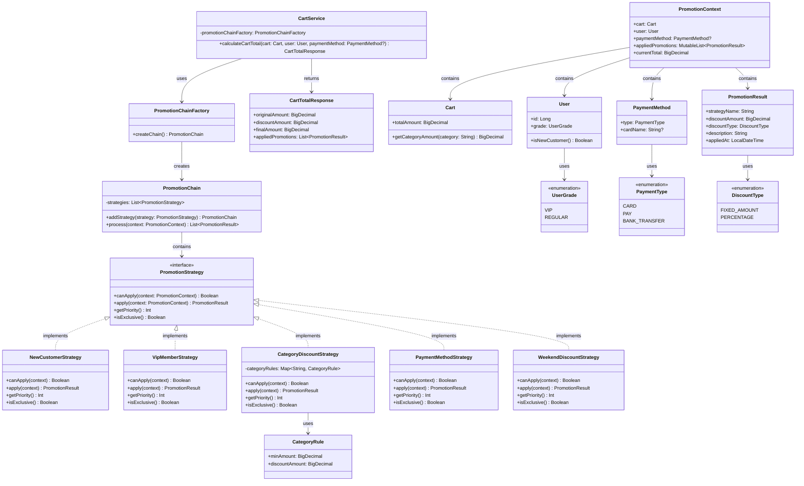
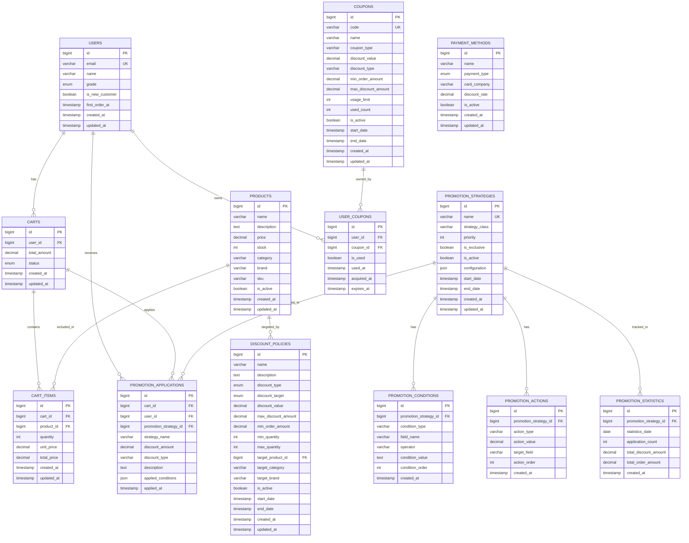

# 🏗️ 프로모션 시스템 솔루션 디자인 문서

## 📋 문서 개요

**프로젝트명**: 장바구니 프로모션 시스템  
**설계 패턴**: Strategy Pattern + Chain of Responsibility  
**문서 버전**: 1.0  
**작성일**: 2024-12-19  

---

## 1. 시스템 아키텍처 개요

### 1.1 핵심 설계 원칙
- **단일 책임 원칙**: 각 프로모션 전략은 하나의 할인 로직만 담당
- **개방-폐쇄 원칙**: 새로운 프로모션 추가 시 기존 코드 수정 없이 확장
- **의존성 역전**: 구체적인 프로모션 로직에 의존하지 않고 인터페이스에 의존

### 1.2 아키텍처 다이어그램
```
┌─────────────────┐    ┌──────────────────┐    ┌─────────────────┐
│   CartService   │───▶│ PromotionChain   │───▶│ PromotionResult │
└─────────────────┘    └──────────────────┘    └─────────────────┘
                                │
                                ▼
                       ┌──────────────────┐
                       │ PromotionStrategy│
                       └──────────────────┘
                                ▲
                    ┌───────────┼───────────┐
                    │           │           │
            ┌─────────────┐ ┌─────────────┐ ┌─────────────┐
            │NewCustomer  │ │VipMember    │ │Category     │
            │Strategy     │ │Strategy     │ │Strategy     │
            └─────────────┘ └─────────────┘ └─────────────┘
```

### 1.3 클래스 다이어그램


### 1.4 클래스별 책임과 역할
- **PromotionStrategy**: 프로모션 적용 로직의 공통 인터페이스 정의
- **NewCustomerStrategy**: 신규 고객 전용 할인 정책 구현
- **VipMemberStrategy**: VIP 회원 대상 퍼센트 할인 정책 구현
- **CategoryDiscountStrategy**: 카테고리별 조건부 할인 정책 구현
- **PaymentMethodStrategy**: 결제 수단별 할인 정책 구현
- **WeekendDiscountStrategy**: 주말 특별 할인 정책 구현
- **PromotionChain**: 프로모션 전략들을 우선순위에 따라 순차 실행
- **PromotionChainFactory**: 프로모션 체인을 생성하고 전략들을 조합
- **CartService**: 장바구니 총액 계산과 프로모션 적용을 조율
- **PromotionContext**: 프로모션 적용에 필요한 모든 컨텍스트 정보 보관
- **PromotionResult**: 개별 프로모션 적용 결과 정보 저장
- **CartTotalResponse**: 최종 계산 결과를 클라이언트에 반환
- **CategoryRule**: 카테고리별 할인 규칙 정의
- **Cart**: 장바구니 정보와 카테고리별 금액 계산 기능 제공
- **User**: 사용자 정보와 회원 등급, 신규 고객 여부 판단 기능 제공
- **PaymentMethod**: 결제 수단 정보와 할인 적용 가능 여부 판단 기능 제공

---

## 2. 핵심 컴포넌트 설계

### 2.1 PromotionStrategy 인터페이스
```kotlin
interface PromotionStrategy {
    /**
     * 프로모션 적용 가능 여부 확인
     */
    fun canApply(context: PromotionContext): Boolean
    
    /**
     * 프로모션 적용 및 결과 반환
     */
    fun apply(context: PromotionContext): PromotionResult
    
    /**
     * 프로모션 우선순위 (낮을수록 높은 우선순위)
     */
    fun getPriority(): Int
    
    /**
     * 다른 프로모션과 중복 적용 가능 여부
     */
    fun isExclusive(): Boolean
}
```

### 2.2 PromotionContext 데이터 클래스
```kotlin
data class PromotionContext(
    val cart: Cart,
    val user: User,
    val paymentMethod: PaymentMethod?,
    val appliedPromotions: MutableList<PromotionResult>,
    val currentTotal: BigDecimal
)
```

### 2.3 PromotionResult 데이터 클래스
```kotlin
data class PromotionResult(
    val strategyName: String,
    val discountAmount: BigDecimal,
    val discountType: DiscountType,
    val description: String,
    val appliedAt: LocalDateTime = LocalDateTime.now()
)
```

### 2.4 PromotionChain 핵심 클래스
```kotlin
class PromotionChain {
    private val strategies = mutableListOf<PromotionStrategy>()
    
    fun addStrategy(strategy: PromotionStrategy): PromotionChain {
        strategies.add(strategy)
        return this
    }
    
    fun process(context: PromotionContext): List<PromotionResult> {
        val results = mutableListOf<PromotionResult>()
        val sortedStrategies = strategies.sortedBy { it.getPriority() }
        
        for (strategy in sortedStrategies) {
            if (strategy.canApply(context)) {
                val result = strategy.apply(context)
                results.add(result)
                
                // 중복 불가 프로모션인 경우 다른 프로모션 적용 중단
                if (strategy.isExclusive()) {
                    break
                }
                
                // 컨텍스트 업데이트
                context.appliedPromotions.add(result)
                context.currentTotal = context.currentTotal.subtract(result.discountAmount)
            }
        }
        
        return results
    }
}
```

---

## 3. 구체적인 프로모션 전략 구현

### 3.1 신규 고객 할인 전략
```kotlin
class NewCustomerStrategy : PromotionStrategy {
    override fun canApply(context: PromotionContext): Boolean {
        return context.user.isNewCustomer() && 
               context.cart.totalAmount >= BigDecimal("100000")
    }
    
    override fun apply(context: PromotionContext): PromotionResult {
        val discountAmount = BigDecimal("15000")
        return PromotionResult(
            strategyName = "신규 고객 할인",
            discountAmount = discountAmount,
            discountType = DiscountType.FIXED_AMOUNT,
            description = "신규 고객 첫 구매 15,000원 할인"
        )
    }
    
    override fun getPriority(): Int = 1  // 최고 우선순위
    
    override fun isExclusive(): Boolean = true  // 다른 할인과 중복 불가
}
```

### 3.2 VIP 회원 할인 전략
```kotlin
class VipMemberStrategy : PromotionStrategy {
    override fun canApply(context: PromotionContext): Boolean {
        return context.user.grade == UserGrade.VIP
    }
    
    override fun apply(context: PromotionContext): PromotionResult {
        val discountAmount = context.currentTotal.multiply(BigDecimal("0.05"))
        return PromotionResult(
            strategyName = "VIP 회원 할인",
            discountAmount = discountAmount,
            discountType = DiscountType.PERCENTAGE,
            description = "VIP 회원 5% 추가 할인"
        )
    }
    
    override fun getPriority(): Int = 3
    
    override fun isExclusive(): Boolean = false  // 다른 할인과 중복 가능
}
```

### 3.3 카테고리 할인 전략
```kotlin
class CategoryDiscountStrategy : PromotionStrategy {
    private val categoryRules = mapOf(
        "뷰티" to CategoryRule(BigDecimal("50000"), BigDecimal("5000")),
        "식품" to CategoryRule(BigDecimal("30000"), BigDecimal("3000"))
    )
    
    override fun canApply(context: PromotionContext): Boolean {
        return categoryRules.any { (category, rule) ->
            val categoryAmount = context.cart.getCategoryAmount(category)
            categoryAmount >= rule.minAmount
        }
    }
    
    override fun apply(context: PromotionContext): PromotionResult {
        var totalDiscount = BigDecimal.ZERO
        val descriptions = mutableListOf<String>()
        
        categoryRules.forEach { (category, rule) ->
            val categoryAmount = context.cart.getCategoryAmount(category)
            if (categoryAmount >= rule.minAmount) {
                totalDiscount = totalDiscount.add(rule.discountAmount)
                descriptions.add("$category ${rule.discountAmount}원 할인")
            }
        }
        
        return PromotionResult(
            strategyName = "카테고리 할인",
            discountAmount = totalDiscount,
            discountType = DiscountType.FIXED_AMOUNT,
            description = descriptions.joinToString(", ")
        )
    }
    
    override fun getPriority(): Int = 2
    
    override fun isExclusive(): Boolean = false
}
```

---

## 4. 서비스 레이어 통합

### 4.1 CartService 업데이트
```kotlin
@Service
class CartService(
    private val promotionChainFactory: PromotionChainFactory
) {
    
    fun calculateCartTotal(cart: Cart, user: User, paymentMethod: PaymentMethod?): CartTotalResponse {
        val context = PromotionContext(
            cart = cart,
            user = user,
            paymentMethod = paymentMethod,
            appliedPromotions = mutableListOf(),
            currentTotal = cart.totalAmount
        )
        
        val promotionChain = promotionChainFactory.createChain()
        val appliedPromotions = promotionChain.process(context)
        
        val finalTotal = cart.totalAmount.subtract(
            appliedPromotions.sumOf { it.discountAmount }
        )
        
        return CartTotalResponse(
            originalAmount = cart.totalAmount,
            discountAmount = appliedPromotions.sumOf { it.discountAmount },
            finalAmount = finalTotal,
            appliedPromotions = appliedPromotions
        )
    }
}
```

### 4.2 PromotionChainFactory
```kotlin
@Component
class PromotionChainFactory {
    
    fun createChain(): PromotionChain {
        return PromotionChain()
            .addStrategy(NewCustomerStrategy())
            .addStrategy(CategoryDiscountStrategy())
            .addStrategy(VipMemberStrategy())
            .addStrategy(PaymentMethodStrategy())
            .addStrategy(WeekendDiscountStrategy())
    }
}
```

---

## 5. 데이터 모델 설계

### 5.1 ERD (Entity Relationship Diagram)


### 5.2 상세 테이블 스키마

#### 5.2.1 사용자 관련 테이블
```sql
-- 사용자 테이블
CREATE TABLE users (
    id BIGINT PRIMARY KEY AUTO_INCREMENT,
    email VARCHAR(255) NOT NULL UNIQUE,
    name VARCHAR(100) NOT NULL,
    grade ENUM('VIP', 'REGULAR') DEFAULT 'REGULAR',
    is_new_customer BOOLEAN DEFAULT TRUE,
    first_order_at TIMESTAMP NULL,
    created_at TIMESTAMP DEFAULT CURRENT_TIMESTAMP,
    updated_at TIMESTAMP DEFAULT CURRENT_TIMESTAMP ON UPDATE CURRENT_TIMESTAMP,
    
    INDEX idx_email (email),
    INDEX idx_grade (grade),
    INDEX idx_new_customer (is_new_customer)
);

-- 장바구니 테이블
CREATE TABLE carts (
    id BIGINT PRIMARY KEY AUTO_INCREMENT,
    user_id BIGINT NOT NULL,
    total_amount DECIMAL(12,2) DEFAULT 0.00,
    status ENUM('ACTIVE', 'CHECKOUT', 'COMPLETED', 'ABANDONED') DEFAULT 'ACTIVE',
    created_at TIMESTAMP DEFAULT CURRENT_TIMESTAMP,
    updated_at TIMESTAMP DEFAULT CURRENT_TIMESTAMP ON UPDATE CURRENT_TIMESTAMP,
    
    FOREIGN KEY (user_id) REFERENCES users(id) ON DELETE CASCADE,
    INDEX idx_user_id (user_id),
    INDEX idx_status (status),
    INDEX idx_created_at (created_at)
);

-- 장바구니 아이템 테이블
CREATE TABLE cart_items (
    id BIGINT PRIMARY KEY AUTO_INCREMENT,
    cart_id BIGINT NOT NULL,
    product_id BIGINT NOT NULL,
    quantity INT NOT NULL DEFAULT 1,
    unit_price DECIMAL(10,2) NOT NULL,
    total_price DECIMAL(12,2) NOT NULL,
    created_at TIMESTAMP DEFAULT CURRENT_TIMESTAMP,
    updated_at TIMESTAMP DEFAULT CURRENT_TIMESTAMP ON UPDATE CURRENT_TIMESTAMP,
    
    FOREIGN KEY (cart_id) REFERENCES carts(id) ON DELETE CASCADE,
    FOREIGN KEY (product_id) REFERENCES products(id) ON DELETE CASCADE,
    INDEX idx_cart_id (cart_id),
    INDEX idx_product_id (product_id),
    UNIQUE KEY uk_cart_product (cart_id, product_id)
);
```

#### 5.2.2 프로모션 전략 테이블
```sql
-- 프로모션 전략 테이블 (기존 promotion_policies를 확장)
CREATE TABLE promotion_strategies (
    id BIGINT PRIMARY KEY AUTO_INCREMENT,
    name VARCHAR(100) NOT NULL UNIQUE,
    strategy_class VARCHAR(200) NOT NULL,
    priority INT NOT NULL DEFAULT 100,
    is_exclusive BOOLEAN DEFAULT FALSE,
    is_active BOOLEAN DEFAULT TRUE,
    configuration JSON,
    start_date TIMESTAMP NULL,
    end_date TIMESTAMP NULL,
    created_at TIMESTAMP DEFAULT CURRENT_TIMESTAMP,
    updated_at TIMESTAMP DEFAULT CURRENT_TIMESTAMP ON UPDATE CURRENT_TIMESTAMP,
    
    INDEX idx_priority (priority),
    INDEX idx_active (is_active),
    INDEX idx_date_range (start_date, end_date),
    INDEX idx_strategy_class (strategy_class)
);

-- 프로모션 조건 테이블
CREATE TABLE promotion_conditions (
    id BIGINT PRIMARY KEY AUTO_INCREMENT,
    promotion_strategy_id BIGINT NOT NULL,
    condition_type VARCHAR(50) NOT NULL, -- 'USER', 'CART', 'PRODUCT', 'PAYMENT', 'TIME'
    field_name VARCHAR(100) NOT NULL,   -- 'user.grade', 'cart.total_amount', 'product.category'
    operator VARCHAR(20) NOT NULL,      -- 'equals', 'greater_than', 'less_than', 'in', 'contains'
    condition_value TEXT NOT NULL,       -- JSON 형태로 복잡한 조건 저장
    condition_order INT NOT NULL DEFAULT 1,
    created_at TIMESTAMP DEFAULT CURRENT_TIMESTAMP,
    
    FOREIGN KEY (promotion_strategy_id) REFERENCES promotion_strategies(id) ON DELETE CASCADE,
    INDEX idx_promotion_strategy (promotion_strategy_id),
    INDEX idx_condition_type (condition_type),
    INDEX idx_field_name (field_name)
);

-- 프로모션 액션 테이블
CREATE TABLE promotion_actions (
    id BIGINT PRIMARY KEY AUTO_INCREMENT,
    promotion_strategy_id BIGINT NOT NULL,
    action_type VARCHAR(50) NOT NULL,    -- 'FIXED_DISCOUNT', 'PERCENTAGE_DISCOUNT', 'FREE_SHIPPING'
    action_value DECIMAL(10,2) NOT NULL,
    target_field VARCHAR(100),           -- 적용 대상 필드
    action_order INT NOT NULL DEFAULT 1,
    created_at TIMESTAMP DEFAULT CURRENT_TIMESTAMP,
    
    FOREIGN KEY (promotion_strategy_id) REFERENCES promotion_strategies(id) ON DELETE CASCADE,
    INDEX idx_promotion_strategy (promotion_strategy_id),
    INDEX idx_action_type (action_type)
);
```

#### 5.2.3 프로모션 적용 이력 테이블
```sql
-- 프로모션 적용 이력 테이블
CREATE TABLE promotion_applications (
    id BIGINT PRIMARY KEY AUTO_INCREMENT,
    cart_id BIGINT NOT NULL,
    user_id BIGINT NOT NULL,
    promotion_strategy_id BIGINT NOT NULL,
    strategy_name VARCHAR(100) NOT NULL,
    discount_amount DECIMAL(10,2) NOT NULL DEFAULT 0.00,
    discount_type VARCHAR(20) NOT NULL, -- 'FIXED_AMOUNT', 'PERCENTAGE'
    description TEXT,
    applied_conditions JSON,            -- 적용된 조건들 저장
    applied_at TIMESTAMP DEFAULT CURRENT_TIMESTAMP,
    
    FOREIGN KEY (cart_id) REFERENCES carts(id) ON DELETE CASCADE,
    FOREIGN KEY (user_id) REFERENCES users(id) ON DELETE CASCADE,
    FOREIGN KEY (promotion_strategy_id) REFERENCES promotion_strategies(id) ON DELETE CASCADE,
    INDEX idx_cart_id (cart_id),
    INDEX idx_user_id (user_id),
    INDEX idx_promotion_strategy (promotion_strategy_id),
    INDEX idx_applied_at (applied_at),
    INDEX idx_strategy_name (strategy_name)
);
```

#### 5.2.4 쿠폰 관련 테이블
```sql
-- 쿠폰 테이블
CREATE TABLE coupons (
    id BIGINT PRIMARY KEY AUTO_INCREMENT,
    code VARCHAR(50) NOT NULL UNIQUE,
    name VARCHAR(100) NOT NULL,
    coupon_type VARCHAR(50) NOT NULL,   -- 'CATEGORY', 'CART', 'PRODUCT', 'SHIPPING'
    discount_value DECIMAL(10,2) NOT NULL,
    discount_type VARCHAR(20) NOT NULL,  -- 'FIXED_AMOUNT', 'PERCENTAGE'
    min_order_amount DECIMAL(12,2) DEFAULT 0.00,
    max_discount_amount DECIMAL(10,2) NULL,
    usage_limit INT DEFAULT -1,           -- -1은 무제한
    used_count INT DEFAULT 0,
    is_active BOOLEAN DEFAULT TRUE,
    start_date TIMESTAMP NULL,
    end_date TIMESTAMP NULL,
    created_at TIMESTAMP DEFAULT CURRENT_TIMESTAMP,
    updated_at TIMESTAMP DEFAULT CURRENT_TIMESTAMP ON UPDATE CURRENT_TIMESTAMP,
    
    INDEX idx_code (code),
    INDEX idx_coupon_type (coupon_type),
    INDEX idx_active (is_active),
    INDEX idx_date_range (start_date, end_date)
);

-- 사용자 쿠폰 테이블
CREATE TABLE user_coupons (
    id BIGINT PRIMARY KEY AUTO_INCREMENT,
    user_id BIGINT NOT NULL,
    coupon_id BIGINT NOT NULL,
    is_used BOOLEAN DEFAULT FALSE,
    used_at TIMESTAMP NULL,
    acquired_at TIMESTAMP DEFAULT CURRENT_TIMESTAMP,
    expires_at TIMESTAMP NULL,
    
    FOREIGN KEY (user_id) REFERENCES users(id) ON DELETE CASCADE,
    FOREIGN KEY (coupon_id) REFERENCES coupons(id) ON DELETE CASCADE,
    INDEX idx_user_id (user_id),
    INDEX idx_coupon_id (coupon_id),
    INDEX idx_is_used (is_used),
    INDEX idx_expires_at (expires_at),
    UNIQUE KEY uk_user_coupon (user_id, coupon_id)
);
```

#### 5.2.5 결제 수단 및 통계 테이블
```sql
-- 결제 수단 테이블
CREATE TABLE payment_methods (
    id BIGINT PRIMARY KEY AUTO_INCREMENT,
    name VARCHAR(100) NOT NULL,
    payment_type ENUM('CARD', 'PAY', 'BANK_TRANSFER', 'POINT') NOT NULL,
    card_company VARCHAR(50) NULL,
    discount_rate DECIMAL(5,2) DEFAULT 0.00, -- 퍼센트
    is_active BOOLEAN DEFAULT TRUE,
    created_at TIMESTAMP DEFAULT CURRENT_TIMESTAMP,
    updated_at TIMESTAMP DEFAULT CURRENT_TIMESTAMP ON UPDATE CURRENT_TIMESTAMP,
    
    INDEX idx_payment_type (payment_type),
    INDEX idx_card_company (card_company),
    INDEX idx_active (is_active)
);

-- 프로모션 통계 테이블
CREATE TABLE promotion_statistics (
    id BIGINT PRIMARY KEY AUTO_INCREMENT,
    promotion_strategy_id BIGINT NOT NULL,
    statistics_date DATE NOT NULL,
    application_count INT DEFAULT 0,
    total_discount_amount DECIMAL(15,2) DEFAULT 0.00,
    total_order_amount DECIMAL(15,2) DEFAULT 0.00,
    created_at TIMESTAMP DEFAULT CURRENT_TIMESTAMP,
    
    FOREIGN KEY (promotion_strategy_id) REFERENCES promotion_strategies(id) ON DELETE CASCADE,
    INDEX idx_promotion_strategy (promotion_strategy_id),
    INDEX idx_statistics_date (statistics_date),
    UNIQUE KEY uk_promotion_date (promotion_strategy_id, statistics_date)
);
```

### 5.3 기본 데이터 삽입
```sql
-- 기본 프로모션 전략 데이터
INSERT INTO promotion_strategies (name, strategy_class, priority, is_exclusive, configuration) VALUES
('신규 고객 할인', 'com.example.demo.strategy.NewCustomerStrategy', 1, TRUE, '{"min_amount": 100000, "discount_amount": 15000}'),
('카테고리 할인', 'com.example.demo.strategy.CategoryDiscountStrategy', 2, FALSE, '{"categories": [{"name": "뷰티", "min_amount": 50000, "discount_amount": 5000}]}'),
('VIP 회원 할인', 'com.example.demo.strategy.VipMemberStrategy', 3, FALSE, '{"discount_rate": 5}'),
('결제 수단 할인', 'com.example.demo.strategy.PaymentMethodStrategy', 4, FALSE, '{"payment_methods": [{"type": "CARD", "company": "X카드", "discount_rate": 10}]}'),
('주말 할인', 'com.example.demo.strategy.WeekendDiscountStrategy', 5, FALSE, '{"discount_rate": 5, "weekend_only": true}');

-- 기본 결제 수단 데이터
INSERT INTO payment_methods (name, payment_type, card_company, discount_rate) VALUES
('X카드', 'CARD', 'X카드', 10.00),
('Y카드', 'CARD', 'Y카드', 5.00),
('페이', 'PAY', NULL, 3.00),
('무통장입금', 'BANK_TRANSFER', NULL, 0.00);

-- 기본 쿠폰 데이터
INSERT INTO coupons (code, name, coupon_type, discount_value, discount_type, min_order_amount, usage_limit) VALUES
('WELCOME2024', '신규회원 환영 쿠폰', 'CART', 10000.00, 'FIXED_AMOUNT', 50000.00, 1000),
('BEAUTY20', '뷰티 카테고리 20% 할인', 'CATEGORY', 20.00, 'PERCENTAGE', 30000.00, 500),
('FREE_SHIPPING', '무료배송 쿠폰', 'SHIPPING', 3000.00, 'FIXED_AMOUNT', 0.00, -1);
```

---

## 6. 테스트 전략

### 6.1 단위 테스트
```kotlin
class NewCustomerStrategyTest {
    
    @Test
    fun `신규 고객이고 10만원 이상일 때 할인 적용`() {
        // Given
        val user = User(isNewCustomer = true)
        val cart = Cart(totalAmount = BigDecimal("120000"))
        val context = PromotionContext(cart, user, null, mutableListOf(), cart.totalAmount)
        val strategy = NewCustomerStrategy()
        
        // When
        val result = strategy.apply(context)
        
        // Then
        assertThat(result.discountAmount).isEqualTo(BigDecimal("15000"))
        assertThat(result.isExclusive()).isTrue()
    }
}
```

### 6.2 통합 테스트
```kotlin
@SpringBootTest
class PromotionChainIntegrationTest {
    
    @Test
    fun `여러 프로모션이 우선순위에 따라 적용`() {
        // Given
        val user = User(grade = UserGrade.VIP, isNewCustomer = false)
        val cart = Cart(totalAmount = BigDecimal("200000"))
        
        // When
        val result = cartService.calculateCartTotal(cart, user, null)
        
        // Then
        assertThat(result.appliedPromotions).hasSize(2)
        assertThat(result.appliedPromotions[0].strategyName).isEqualTo("카테고리 할인")
        assertThat(result.appliedPromotions[1].strategyName).isEqualTo("VIP 회원 할인")
    }
}
```

---

## 7. 성능 고려사항

### 7.1 캐싱 전략
- **프로모션 정책 캐싱**: Redis를 활용한 정책 정보 캐싱
- **사용자 정보 캐싱**: 회원 등급, 신규 고객 여부 등 캐싱
- **카테고리별 금액 계산 결과 캐싱**

### 7.2 비동기 처리
- **프로모션 적용 이력 저장**: 비동기로 처리하여 응답 시간 단축
- **통계 데이터 수집**: 별도 스레드에서 처리

---

## 8. 모니터링 및 로깅

### 8.1 로깅 전략
```kotlin
@Component
class PromotionLogger {
    
    fun logPromotionApplication(context: PromotionContext, result: PromotionResult) {
        log.info("프로모션 적용: 사용자={}, 전략={}, 할인금액={}", 
                context.user.id, result.strategyName, result.discountAmount)
    }
}
```

### 8.2 메트릭 수집
- 프로모션별 적용 횟수
- 평균 할인 금액
- 프로모션 적용 실패율
- 응답 시간 분포

---

## 9. 향후 확장 계획

### 9.1 Rule Engine으로의 전환
- 현재 Strategy를 Rule 기반으로 점진적 전환
- JSON/DSL 기반 프로모션 정의 지원
- 관리자 콘솔을 통한 실시간 정책 수정

### 9.2 마이크로서비스 분리
- 프로모션 서비스 독립 배포
- 이벤트 기반 프로모션 적용
- A/B 테스트 기능 추가

---

## 10. 구현 체크리스트

- [ ] PromotionStrategy 인터페이스 정의
- [ ] PromotionContext, PromotionResult 데이터 클래스 구현
- [ ] PromotionChain 핵심 로직 구현
- [ ] 기본 프로모션 전략들 구현 (신규고객, VIP, 카테고리 등)
- [ ] CartService 통합
- [ ] 데이터베이스 스키마 생성
- [ ] 단위 테스트 작성
- [ ] 통합 테스트 작성
- [ ] 로깅 및 모니터링 구현
- [ ] 성능 테스트 및 최적화

---

**문서 작성자**: AI Assistant  
**검토자**: 개발팀  
**승인자**: 기술 리더
