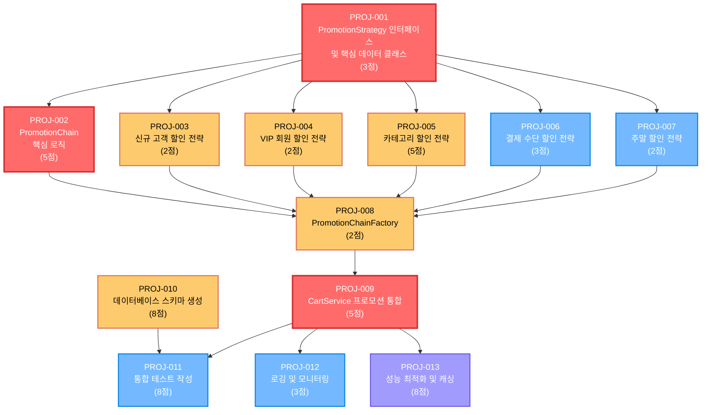

# 🔗 프로모션 시스템 Task 의존성 그래프

## 📊 의존성 다이어그램



## 📋 의존성 매트릭스

| 티켓 ID | 의존하는 티켓 | 의존받는 티켓 | 의존도 |
|---------|---------------|---------------|--------|
| PROJ-001 | 없음 | PROJ-002, PROJ-003, PROJ-004, PROJ-005, PROJ-006, PROJ-007 | 기반 |
| PROJ-002 | PROJ-001 | PROJ-008 | 높음 |
| PROJ-003 | PROJ-001 | PROJ-008 | 높음 |
| PROJ-004 | PROJ-001 | PROJ-008 | 높음 |
| PROJ-005 | PROJ-001 | PROJ-008 | 높음 |
| PROJ-006 | PROJ-001 | PROJ-008 | 높음 |
| PROJ-007 | PROJ-001 | PROJ-008 | 높음 |
| PROJ-008 | PROJ-002, PROJ-003, PROJ-004, PROJ-005, PROJ-006, PROJ-007 | PROJ-009 | 높음 |
| PROJ-009 | PROJ-008 | PROJ-011, PROJ-012, PROJ-013 | 높음 |
| PROJ-010 | 없음 | PROJ-011 | 중간 |
| PROJ-011 | PROJ-009, PROJ-010 | 없음 | 중간 |
| PROJ-012 | PROJ-009 | 없음 | 낮음 |
| PROJ-013 | PROJ-009 | 없음 | 낮음 |

## 🎯 Critical Path 분석

### 🔴 핵심 경로 (Critical Path)
```
PROJ-001 → PROJ-002 → PROJ-008 → PROJ-009 → PROJ-011
```
**총 소요 시간**: 3 + 5 + 2 + 5 + 8 = **23점**

### 🟡 병렬 가능 경로들
1. **전략 구현 경로** (PROJ-001 → PROJ-003,004,005,006,007 → PROJ-008)
2. **데이터베이스 경로** (PROJ-010 → PROJ-011)
3. **최적화 경로** (PROJ-009 → PROJ-012,013)

## 📅 Sprint별 의존성 고려사항

### Sprint 1 (Critical 우선순위)
- **PROJ-001**: 기반이 되는 인터페이스 (다른 모든 티켓의 전제조건)
- **PROJ-002**: 체인 로직 구현 (전략들의 실행 환경)
- **PROJ-009**: 서비스 통합 (전체 플로우 완성)

### Sprint 2 (High 우선순위)
- **PROJ-003,004,005**: 전략 구현 (PROJ-001 의존)
- **PROJ-008**: 팩토리 구현 (모든 전략 의존)
- **PROJ-010**: DB 스키마 (독립적, PROJ-011과 병렬 가능)

### Sprint 3 (Medium 우선순위)
- **PROJ-006,007**: 나머지 전략들 (PROJ-001 의존)
- **PROJ-011**: 통합 테스트 (PROJ-009, PROJ-010 의존)

### Sprint 4 (최적화)
- **PROJ-012,013**: 모니터링 및 최적화 (PROJ-009 의존)

## ⚠️ 의존성 위험 요소

### 🔴 높은 위험도
- **PROJ-001 지연**: 모든 전략 구현이 블로킹됨
- **PROJ-002 지연**: 팩토리 구현이 블로킹됨
- **PROJ-008 지연**: 서비스 통합이 블로킹됨

### 🟡 중간 위험도
- **PROJ-009 지연**: 통합 테스트와 최적화 작업 블로킹
- **PROJ-010 지연**: 통합 테스트 블로킹

### 🟢 낮은 위험도
- **PROJ-012,013 지연**: 다른 작업에 영향 없음

## 🚀 최적화 제안

### 1. 병렬 개발 가능 영역
- **전략 구현들** (PROJ-003,004,005,006,007): PROJ-001 완료 후 동시 진행 가능
- **데이터베이스 작업** (PROJ-010): 다른 작업과 독립적으로 진행 가능
- **모니터링/최적화** (PROJ-012,013): PROJ-009 완료 후 동시 진행 가능

### 2. 리스크 완화 방안
- **PROJ-001 우선 완료**: 다른 모든 작업의 기반이므로 최우선 처리
- **단계별 검증**: 각 전략별로 단위 테스트를 통한 조기 검증
- **모킹 활용**: 의존성 있는 컴포넌트의 모킹을 통한 병렬 개발

---

**문서 작성자**: AI Assistant  
**작성일**: 2024-12-19  
**버전**: 1.0
